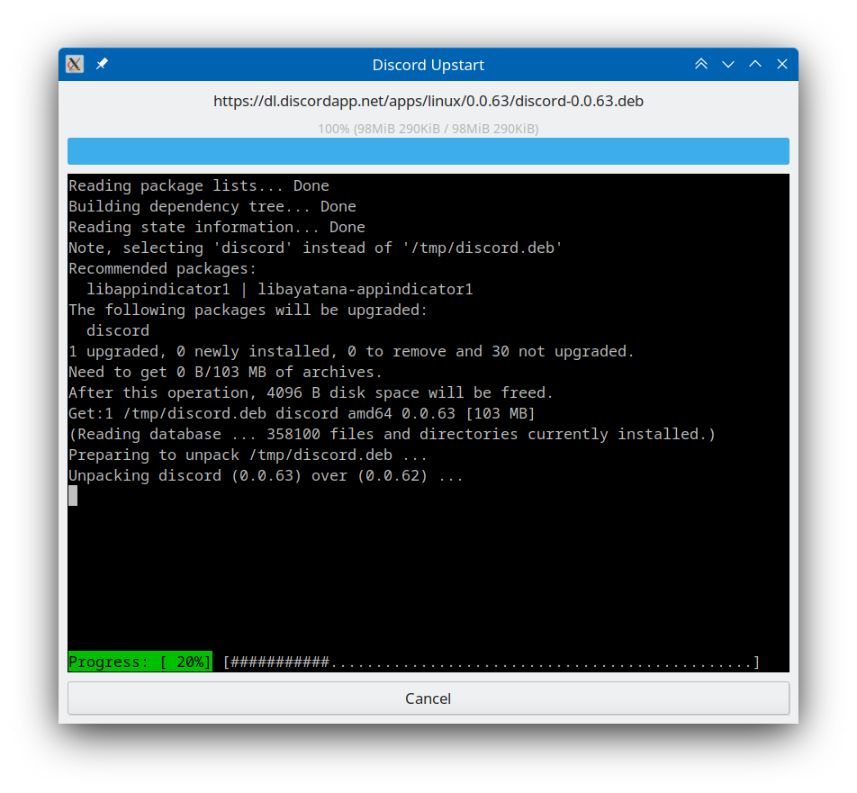

<div align="center">

Discord Upstart  

========
</div>

Discord Upstart is a Discord launcher with automatic debian package installation.



Building
--------

```sh
exe="bin/debug-linux-x86_64/discord-upstart" &&
dub build &&
sudo chown 0:0 "$exe" &&
sudo chmod +s "$exe"
```

License
-------
Discord Upstart is licensed under the [Boost Software License 1.0](LICENSE_1_0.txt).
